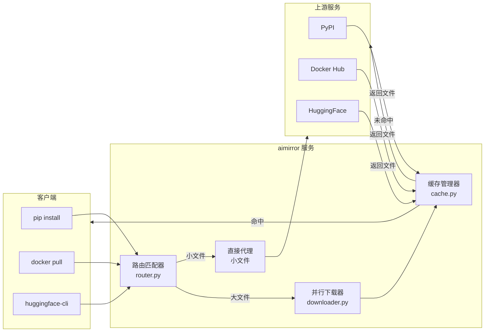

# 🚀 aimirror

[](https://www.python.org/)
[](https://fastapi.tiangolo.com/)
[](LICENSE)

> AI 时代的下载镜像加速器 —— 被慢速网络逼疯的工程师的自救工具

## 💡 项目背景

作为一名 AI 工程师，每天的工作离不开：
- `pip install torch` —— 几百 MB 的 wheel 包下载到地老天荒
- `docker pull nvidia/cuda` —— 几个 GB 的镜像层反复下载
- `huggingface-cli download` —— 模型文件从 HuggingFace 蜗牛般爬过来

公司内网有代理，但单线程下载大文件依然慢得让人崩溃。重复下载相同的包？不存在的缓存。忍无可忍，于是写了这个工具。

**aimirror** = 智能路由 + 并行分片下载 + 本地缓存，让下载速度飞起来。

## ✨ 功能特性

- **⚡ 并行下载** —— HTTP Range 分片，多线程并发，榨干带宽
- **💾 智能缓存** —— 基于文件 digest 去重，LRU 自动淘汰
- **🎯 动态路由** —— 小文件直接代理，大文件自动并行
- **🔗 多源支持** —— Docker Hub、PyPI、CRAN、HuggingFace 开箱即用
- **🔌 任意扩展** —— 只要是 HTTP 下载，配置一条规则即可几十倍加速

## 🏗️ 架构



## 🚀 快速开始

```bash
# 安装
pip install -r requirements.txt

# 启动
python main.py

# 使用
curl http://localhost:8081/health
```

## 🔧 客户端配置

**pip**
```bash
pip install torch --index-url http://localhost:8081/simple --trusted-host localhost:8081
```

**Docker**
```json
{
  "registry-mirrors": ["http://localhost:8081"]
}
```

**HuggingFace (huggingface-cli)**
```bash
# 设置环境变量
export HF_ENDPOINT=http://localhost:8081

# 下载模型
huggingface-cli download TheBloke/Llama-2-7B-GGUF llama-2-7b.Q4_K_M.gguf
```

或使用 Python:
```python
import os
os.environ["HF_ENDPOINT"] = "http://localhost:8081"

from huggingface_hub import hf_hub_download
hf_hub_download(repo_id="TheBloke/Llama-2-7B-GGUF", filename="llama-2-7b.Q4_K_M.gguf")
```

## 📖 API

| 路径 | 说明 |
|------|------|
| `/*` | 代理到对应上游 (Docker/PyPI/CRAN/HuggingFace) |
| `/health` | 健康检查 |
| `/stats` | 缓存统计 |

## 🐳 Docker 部署

```bash
# 使用 GitHub Container Registry
docker pull ghcr.io/your-username/aimirror:main

# 运行
docker run -d -p 8081:8081 -v $(pwd)/cache:/data/fast_proxy/cache ghcr.io/your-username/aimirror:main
```

## ⚙️ 配置示例

```yaml
server:
  host: "0.0.0.0"
  port: 8081
  upstream_proxy: "http://proxy.company.com:8080"  # 公司代理

cache:
  dir: "./cache"
  max_size_gb: 100

rules:
  - name: docker-blob
    pattern: "/v2/.*/blobs/sha256:[a-f0-9]+"
    strategy: parallel
    min_size: 1048576
    concurrency: 20
    chunk_size: 10485760

  # HuggingFace GGUF 模型（临时签名 URL 缓存优化）
  - name: huggingface-gguf
    pattern: '/.*/(blob|resolve)/main/.+\.gguf$'
    strategy: parallel
    min_size: 1048576
    concurrency: 20
    chunk_size: 10485760
    cache_key_source: original  # 使用原始 URL 作为缓存 key

  # 示例：扩展任意 HTTP 下载站点
  # - name: my-custom-repo
  #   pattern: '/downloads/.+\.(tar\.gz|zip|bin)$'
  #   strategy: parallel
  #   min_size: 10485760    # 10MB 以上启用并行
  #   concurrency: 16
  #   chunk_size: 20971520  # 20MB 分片
```

## 📄 License

MIT